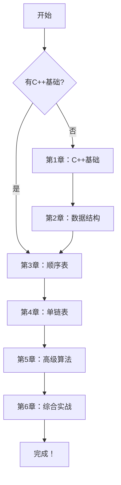

# 线性表完全教程

> 从零基础到完整实现 - 数据结构与算法入门指南

[](https://isocpp.org/)
[](https://en.wikipedia.org/wiki/C%2B%2B11)
[](LICENSE)

## 📖 项目简介

本项目是一套完整的线性表教程，采用**费曼学习法**，用最简单的语言和最生动的比喻，帮助初学者从零开始掌握线性表的实现。

### 适合人群

- ✅ 数据结构初学者
- ✅ C++ 初学者
- ✅ 需要完成课程作业的学生
- ✅ 想要深入理解基础数据结构的编程爱好者

### 教程特色

- 📚 **循序渐进** - 从 C++ 基础到高级算法，一步步深入
- 🎨 **图文并茂** - 每个算法都配有详细的步骤图解
- 💡 **费曼教学** - 用生活比喻解释复杂概念
- 🔧 **实战导向** - 所有代码可直接运行
- 📝 **详细注释** - 每行关键代码都有说明
- ✏️ **练习系统** - 每章配有练习题和答案

## 🗂️ 项目结构

```
linear-list-tutorial/
├── docs/                           # 教程文档
│   ├── 01-cpp-basics.md           # 第1章：C++基础知识
│   ├── 02-data-structure-basics.md # 第2章：数据结构基础
│   ├── 03-sequential-list.md      # 第3章：顺序表完整实现
│   ├── 04-linked-list.md          # 第4章：单链表完整实现
│   ├── 05-advanced-algorithms.md  # 第5章：高级算法实现
│   └── 06-comprehensive-practice.md # 第6章：综合应用与实战
├── src/                           # 源代码
│   ├── sequential-list/           # 顺序表实现
│   │   ├── SeqList.h
│   │   ├── SeqList.cpp
│   │   └── SeqList_main.cpp
│   └── linked-list/               # 单链表实现
│       ├── LinkList.h
│       ├── LinkList.cpp
│       └── LinkList_main.cpp
├── guides/                        # 实用指南
│   ├── assignment-guide.md        # 作业提交指南
│   ├── dev-cpp-guide.md          # DEV C++ 使用指南
│   └── code-summary.md           # 新增代码汇总
└── README.md                      # 项目说明（本文件）
```

## 🚀 快速开始

### 方式一：直接运行代码

```bash
# 克隆项目
git clone https://github.com/yourusername/linear-list-tutorial.git
cd linear-list-tutorial

# 使用 g++ 编译顺序表
cd src/sequential-list
g++ -std=c++11 -o SeqList SeqList_main.cpp
./SeqList

# 使用 g++ 编译单链表
cd ../linked-list
g++ -std=c++11 -o LinkList LinkList_main.cpp
./LinkList
```

### 方式二：使用 DEV C++

1. 打开 DEV C++
2. 文件 → 打开 → 选择 `SeqList_main.cpp` 或 `LinkList_main.cpp`
3. 按 F11 编译运行

详细步骤请查看：[DEV C++ 使用指南](guides/dev-cpp-guide.md)

### 方式三：系统学习

按顺序阅读教程文档：

1. [第1章：C++ 基础知识](docs/01-cpp-basics.md) - 2小时
2. [第2章：数据结构基础](docs/02-data-structure-basics.md) - 1小时
3. [第3章：顺序表完整实现](docs/03-sequential-list.md) - 3小时
4. [第4章：单链表完整实现](docs/04-linked-list.md) - 3小时
5. [第5章：高级算法实现](docs/05-advanced-algorithms.md) - 2小时
6. [第6章：综合应用与实战](docs/06-comprehensive-practice.md) - 2小时

**总学时：约 13 小时**

## 📚 学习路线



## 🎯 学习目标

完成本教程后，你将能够：

- 理解线性表的逻辑结构和物理结构
- 独立实现顺序表和单链表
- 掌握基本的算法设计和分析方法
- 理解时间复杂度和空间复杂度
- 实现逆置、排序等高级算法
- 为学习更高级的数据结构打下坚实基础

## 💻 核心功能

### 顺序表（Sequential List）

- 创建和初始化
- 插入和删除操作
- 查找操作（按位查找、按值查找）
- **逆置算法**（双指针法）- O(n)
- **排序算法**（冒泡排序优化版）- O(n²)

### 单链表（Linked List）

- 头结点设计
- 动态内存管理
- 插入和删除操作
- 查找和遍历
- **逆置算法**（头插法）- O(n)
- **排序算法**（选择排序）- O(n²)

## 📊 算法复杂度对比

| 操作 | 顺序表 | 单链表 |
|------|--------|--------|
| 访问第i个元素 | O(1) | O(n) |
| 查找元素 | O(n) | O(n) |
| 插入元素 | O(n) | O(1)* |
| 删除元素 | O(n) | O(1)* |
| 逆置操作 | O(n) | O(n) |
| 排序操作 | O(n²) | O(n²) |

*注：不包括查找定位的时间

## 🔧 开发环境

- **编译器**：支持 C++11 标准的编译器
  - GCC 4.8.1+
  - Clang 3.3+
  - MSVC 2013+
  - DEV C++ 5.11+
- **操作系统**：Windows / Linux / macOS
- **IDE（可选）**：DEV C++ / Visual Studio / CLion / VS Code

